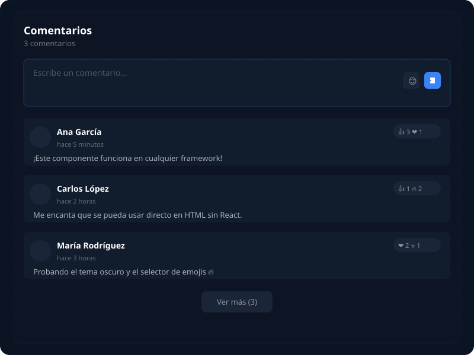

# comment-section

Web Component de comentarios listo para usar en **HTML, React, Astro, Next.js, Vue y cualquier framework**.

- 🌙 Tema dark/light
- 😊 Reacciones con emojis
- 📱 Responsive grid (1–3 columnas)
- ♿ Accesible (ARIA labels, live regions)
- ⚡ ~12 KB gzip, sin dependencias pesadas
- 📦 TypeScript + Tests

## Vista previa



## Instalación

```sh
npm install comment-section
```

## Uso rápido

**HTML plano:**

```html
<script type="module">
  import "comment-section";
</script>
<comment-section></comment-section>
```

**React / Astro / Next.js:**

```jsx
import "comment-section";

function App() {
  return <comment-section max-comments="6" placeholder="Deja tu comentario..." theme="dark" />;
}
```

**CDN (sin npm):**

```html
<script src="https://unpkg.com/comment-section"></script>
<comment-section theme="light"></comment-section>
```

## Atributos

| Atributo       | Tipo             | Default                         | Descripción                                   |
|----------------|------------------|----------------------------------|-----------------------------------------------|
| `max-comments` | `number`         | `6`                              | Comentarios visibles antes de "Ver más"       |
| `placeholder`  | `string`         | `"Escribe un comentario..."`     | Placeholder del textarea                      |
| `theme`        | `"dark"\|"light"`| `"dark"`                         | Tema del componente                           |
| `char-limit`   | `number`         | `500`                            | Máximo de caracteres por comentario           |

> También acepta la propiedad JS `initialComments: Comment[]` para cargar comentarios existentes.

## Documentación

Visita la [documentación completa](https://ingyesid24.github.io/components-comentarios/) con ejemplos interactivos, guía rápida y referencia de API.

## Desarrollo

```sh
git clone https://github.com/ingyesid24/components-comentarios.git
cd components-comentarios
npm install
npm run build    # Compila la librería
npm test         # Ejecuta los tests
```

## Docs site

```sh
cd docs
npm install
npm run dev      # http://localhost:4321
```

## Contribuir

La rama `main` está protegida. No se permite push directo ni merge sin PR aprobado.

1. Haz fork del repo
2. Crea una rama: `git checkout -b mi-feature`
3. Haz tus cambios y corre los tests: `npm test`
4. Asegúrate de que la build pase: `npm run build`
5. Abre un Pull Request describiendo los cambios
6. Espera la revisión y aprobación

### Reportar bugs

Si encuentras un bug, [abre un issue aquí](https://github.com/ingyesid24/components-comentarios/issues/new).

## Licencia

MIT — [LICENSE](LICENSE) — Copyright (c) 2026 ingyesid24. Puedes usarlo, modificarlo y distribuirlo libremente.
